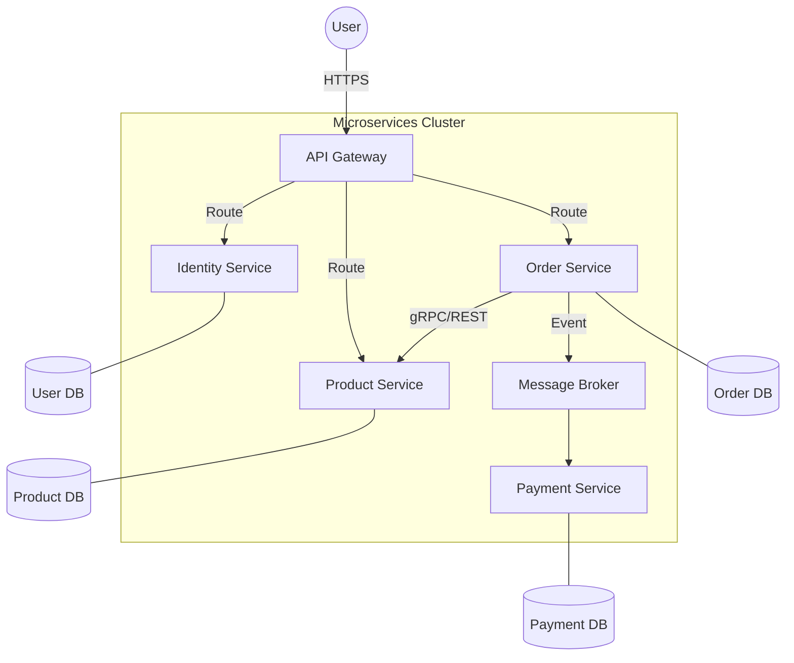

# Microservice Architectural Pattern

Microservices - also known as the microservice architecture - is an architectural style that structures an application as a collection of services that are:
- Highly maintainable and testable
- Loosely coupled
- Independently deployable
- Organized around business capabilities
- Owned by a small team

## Example
Consider an E-commerce application. In a **monolithic** architecture, the UI, Authentication, Product Catalog, Cart, and Order Processing are all part of a single codebase and unit of deployment.
In a **Microservices** architecture:
- **Identity Service**: Manages user profiles and authentication.
- **Product Service**: Manages catalog and inventory.
- **Ordering Service**: Handles order creation and tracking.
- **Payment Service**: Integrates with external payment gateways.

---

## How it Works
Microservices work by breaking down a large application into smaller, specialized services that communicate over a network using lightweight protocols (typically HTTP/REST, gRPC, or Message Queues).

### Communication Flow:
1.  **Client Request**: A user interacts with the UI (Web/Mobile).
2.  **API Gateway**: The request hits an API Gateway, which acts as a single entry point.
3.  **Routing**: The Gateway routes the request to the appropriate microservice.
4.  **Service Interaction**: If the "Ordering Service" needs user details, it calls the "Identity Service" via an internal API or reads from a shared cache.
5.  **Data Storage**: Each service typically has its own dedicated database.

---

## Building Blocks
1.  **Independent Services**: Each service performs a single business function.
2.  **API Gateway**: Handles authentication, rate limiting, and request routing.
3.  **Service Discovery**: Allows services to find each other dynamically (e.g., Consul, Eureka).
4.  **Centralized Configuration**: Management of environment-specific settings (e.g., Spring Cloud Config, AWS AppConfig).
5.  **Message Brokers**: For asynchronous communication (e.g., RabbitMQ, Apache Kafka).
6.  **Observability Tools**: Logging (ELK Stack), Metrics (Prometheus/Grafana), and Tracing (Jaeger/Zipkin).

---

## Visual Representation

---

## Configuring with AWS
AWS provides a robust suite of tools for microservices:
- **Compute**: AWS Lambda (Serverless) or Amazon ECS/EKS (Containers).
- **API Management**: Amazon API Gateway.
- **Communication**: Amazon SNS/SQS (Messaging), AWS App Mesh (Service Mesh).
- **Service Discovery**: AWS Cloud Map.
- **Data**: Amazon RDS (Relational), Amazon DynamoDB (NoSQL).
- **CI/CD**: AWS CodePipeline, CodeBuild, and CodeDeploy.

**Example Setup**:
1.  **EKS** hosts the containerized services.
2.  **API Gateway** routes traffic to the EKS Load Balancer.
3.  **DynamoDB** provides a per-service database with high availability.

---

## How Docker is Used
Docker is the standard for packaging microservices.
- **Isolation**: Each service runs in its own container with its specific dependencies (e.g., Java 17 for Service A, Node.js 18 for Service B).
- **Portability**: Ensures the service runs exactly the same in Dev, Staging, and Production.
- **Efficiency**: Containers share the host OS kernel, making them much lighter than VMs.
- **Orchestration**: Docker containers are usually managed by **Kubernetes** (K8s) or **Docker Swarm** to handle scaling and self-healing.

---

## How Data is Shared
Sharing data is one of the biggest challenges in microservices.
1.  **Database per Service (Preferred)**: Each service owns its data. Others must use APIs to access it.
2.  **API Composition**: A "BFF" (Backend for Frontend) calls multiple services and aggregates the results.
3.  **Event-Driven (CQRS/Event Sourcing)**: Services publish events (e.g., `OrderCreated`) and other services subscribe to update their local read-models.
4.  **Shared Cache**: Using Redis for frequently accessed read-only data (use with caution to avoid coupling).

---

## Fault Tolerance
To prevent a single service failure from bringing down the whole system:
1.  **Circuit Breaker**: Stops requests to a failing service to allow it to recover (e.g., Resilience4j).
2.  **Retries with Exponential Backoff**: Retrying failed requests with increasing wait times.
3.  **Bulkhead Pattern**: Isolates resources (like thread pools) for different services so one's failure doesn't exhaust the system.
4.  **Timeouts**: Ensuring requests don't hang indefinitely.
5.  **Dead Letter Queues (DLQ)**: Storing failed messages for later inspection/re-processing.

---

## Best Resources
- **Books**: 
    - *Building Microservices* by Sam Newman.
    - *Microservices Patterns* by Chris Richardson.
- **Websites**:
    - [Microservices.io](https://microservices.io/) - A comprehensive guide by Chris Richardson.
    - [Martin Fowler on Microservices](https://martinfowler.com/articles/microservices.html).
- **Courses**:
    - AWS Certified Solutions Architect courses (covers AWS-specific microservice patterns).
    - Kubernetes Documentation (essential for deployment).

