# App0 System & Interview Prep (Lead Python Engineer)

This document summarizes App0’s architecture and maps it to the Lead Python Developer role (API & Cloud Systems). Use it as an interview crib sheet: concise Q&A, HLD/LLD views, schemas, event-driven flows, and talking points on strengths and improvements.

---

## Quick Role-Matching Q&A
- **Q:** How does your experience align to FastAPI + AWS microservices?  
  **A:** App0-mono services (e.g., `app0-tools-service`) are FastAPI-based, deployed as Lambda and ECS containers with multi-stage Docker builds, CodeArtifact deps, and environment-aware configs. Patterns: Pydantic validation, typed services/routers, Structlog + OTEL, and SAM/ECS deploys.
- **Q:** Event-driven workflows with Step Functions/SQS/SNS?  
  **A:** Async processing uses SQS for decoupling, SNS/EventBridge for fan-out, and Step Functions for orchestrating long-running flows (retries/backoff, DLQs). Workflows emit domain events consumed by async processors and notification fan-out.
- **Q:** Real-time/streaming APIs?  
  **A:** Webchat uses Stream Chat + WebSockets; Django backend (vigilant-funicular) exposes chat/admin APIs and integrates with Stream, while Lambda/WebSocket handlers provide live updates and typing indicators. Kinesis could be slotted for high-volume telemetry if needed.
- **Q:** GenAI integrations (ChatGPT/Gemini)?  
  **A:** `app0-connector-llms` encapsulates OpenAI/Gemini calls; tools service and backend agents call through this connector with guardrails, token limits, and cost-aware batching.
- **Q:** Multi-tenant authN/authZ story?  
  **A:** Dedicated Authorizer Lambda generates tenant-scoped IAM policies (JWT/Cognito, API key, custom token, client ID). Downstream services enforce tenant isolation at data and IAM levels.
- **Q:** Data choices (PostgreSQL vs DynamoDB)?  
  **A:** Core backend favors DynamoDB for multi-tenant isolation and scale; Postgres is used where relational integrity is key (e.g., workflow definitions, audits). Libraries and services are designed to swap storage adapters as needed.
- **Q:** Team leadership and delivery?  
  **A:** CI/CD via GitHub Actions + environment promotion (dev01 → sandbox → stage01 → prod), clear dependency graph (libs → services), Makefile orchestration, and code-quality gates (Ruff/Mypy/Pytest) support predictable delivery and mentoring.

---

## High-Level Design (platform view)

```mermaid
graph TD
    subgraph Frontend
        WC[Webchat widgets (Vite/TS)]
        SW[Sturdy-Waffle admin (React/MUI)]
    end

    subgraph Edge
        APIGW[API Gateway]
        AUTH[Authorizer Lambda]
        CF[CloudFront + S3 assets]
    end

    subgraph Services (Python)
        TOOLS[FastAPI tools service (Lambda/ECS)]
        VF[Django backend (vigilant-funicular)]
        ASYNC[Async processors (SQS consumers)]
    end

    subgraph Data
        DDB[(DynamoDB - multi-tenant)]
        PG[(PostgreSQL - relational)]
        S3[(S3 - artifacts/assets)]
    end

    subgraph Integrations
        LLM[LLM APIs (OpenAI/Gemini)]
        SHOP[Shopify/Klaviyo/etc.]
        STREAM[Stream Chat]
    end

    WC --> APIGW
    SW --> APIGW
    APIGW --> AUTH --> TOOLS
    APIGW --> AUTH --> VF
    TOOLS --> DDB
    TOOLS --> PG
    VF --> DDB
    VF --> PG
    TOOLS --> ASYNC
    VF --> ASYNC
    ASYNC --> S3
    TOOLS --> LLM
    VF --> SHOP
    VF --> STREAM
    CF --> WC
    CF --> SW
```

---

## Low-Level Design (service & workflow focus)
- **Boundary contracts:** FastAPI routers/Pydantic schemas; Django DRF serializers for admin APIs; strict request/response typing.
- **Auth path:** API Gateway → Authorizer Lambda → tenant-scoped IAM context → downstream services read `tenant_id` and role claims; service-level RBAC and resource scoping.
- **Command/query separation:** Mutation endpoints enqueue commands (SQS) or start Step Functions; query endpoints read from DynamoDB projections or Postgres views for consistency.
- **Connectors layer:** `app0-connector-*` libs wrap third-party APIs (Shopify, Stream, LLMs) with retries, backoff, idempotency keys, and structured error maps.
- **Observability:** Structlog + OTEL tracing; CloudWatch/X-Ray; DLQs for failed async; metrics on auth success/failure, queue age, token usage.
- **Resilience patterns:** Timeouts everywhere, circuit breakers on external APIs, DLQs for SQS, idempotent consumers (message keys), exponential backoff, bulkheads per connector.

---

## Event-Driven Architecture

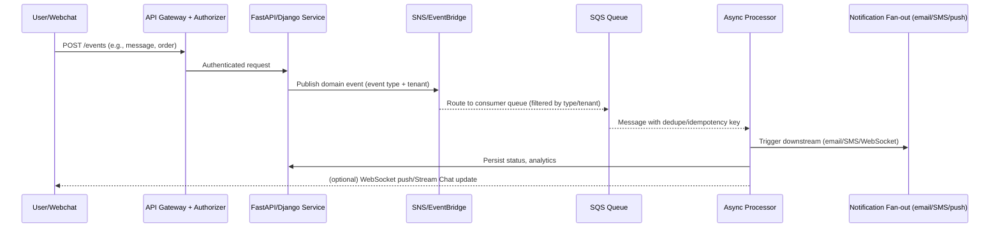

Key tech: SNS/EventBridge for routing, SQS standard or FIFO with content-based dedupe, DLQs, Step Functions for long-running workflows (human-in-the-loop, retries).

---

## Schema Designs (workflow, notifications, FAQs)

### Workflow (relational for integrity, DynamoDB for runtime state)
- **PostgreSQL (definitions & versions)**  
  - `workflow_definitions(id, name, version, status, created_by, created_at)`  
  - `workflow_steps(id, workflow_id, step_type, config_json, order_index)`  
  - `workflow_transitions(id, workflow_id, from_step_id, to_step_id, condition)`  
  - `workflow_audits(id, workflow_id, action, actor, at, payload_json)`  
- **DynamoDB (instances & runtime state)**  
  - PK: `tenant_id#workflow_instance_id`, SK: `step_ts`  
  - Attributes: `state`, `current_step`, `context`, `attempts`, `expires_at`

### Notifications
- **PostgreSQL (templates & preferences)**  
  - `notification_templates(id, channel, locale, subject, body, version)`  
  - `notification_preferences(tenant_id, user_id, channel, enabled, window)`  
- **DynamoDB (outbox/events)**  
  - PK: `tenant_id#notification_id`, SK: `channel#ts`  
  - Attributes: `event_type`, `payload`, `status`, `retries`, `dedupe_key`

### FAQs / Knowledge
- **PostgreSQL (authoring & curation)**  
  - `faq_items(id, tenant_id, question, answer, tags, source, status)`  
  - `faq_versions(id, faq_id, version, embedding_ref, created_at)`  
- **Vector store (external) or DynamoDB index** for embeddings reference;  
  DynamoDB item keyed by `tenant_id#faq_id` for fast retrieval and caching.

---

## Current Design: Pros, Cons, Improvements
- **Pros**
  - Clear separation: frontend widgets, admin app, backend services, auth, connectors.
  - Multi-tenant enforced at auth and data layers (Authorizer + DDB keys).
  - Strong CI/CD and environment promotion; independent deployable units.
  - Event-driven foundation with async queues and connector isolation.
  - Reusable connector libraries reduce API-integration risk and duplication.
- **Cons / Risks**
  - Mixed tech stacks (FastAPI + Django) increase cognitive load and tooling overlap.
  - DynamoDB + Postgres duality can lead to data model drift and sync gaps.
  - Webchat bundle size (UMD) can bloat embed performance; careful optimization needed.
  - Step Functions/SQS/SNS topology not fully codified as IaC in all services.
  - Observability varies by project (Ruff/Mypy enforced in mono, but not uniformly in all JS apps).
- **Improvements**
  - Standardize IaC for event buses/queues/Step Functions per service module.
  - Tighten schema contracts: shared proto/JSON Schema for events; central type package.
  - Add pervasive idempotency keys + outbox pattern for all mutating writes.
  - Expand bundle-splitting and CDN hints for webchat; RUM-based perf budgets.
  - Unify tracing: OTEL propagation across authorizer → API → async workers.

---

## Critical Technologies to Review Before Interview
- **Python services:** FastAPI patterns (dependency injection, background tasks), Django DRF and middleware, Pydantic v2 nuances.
- **AWS serverless & containers:** Lambda cold-start mitigation, SAM templates, multi-stage Docker builds, ECS Fargate basics.
- **Event stack:** SQS/SNS/EventBridge filtering, DLQs, FIFO vs standard trade-offs, Step Functions retry/backoff, idempotency strategies.
- **Data:** DynamoDB modeling (partition/sort keys, GSIs, hot partitions), Postgres migrations, dual-write avoidance, vector-search integration.
- **Auth:** API Gateway custom authorizers, Cognito JWT validation, tenant-scoped IAM policies, STS, policy caching.
- **Real-time:** Stream Chat/WebSockets patterns, backpressure, reconnects, presence/typing indicators.
- **GenAI:** Rate limits, token budgeting, safety/guardrails, deterministic prompts, cost controls, embedding/versioning strategy.

---

## Visuals for Talking Points

### Tenant-Safe Data Access
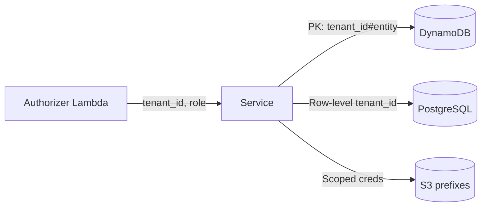

### Notification Fan-out
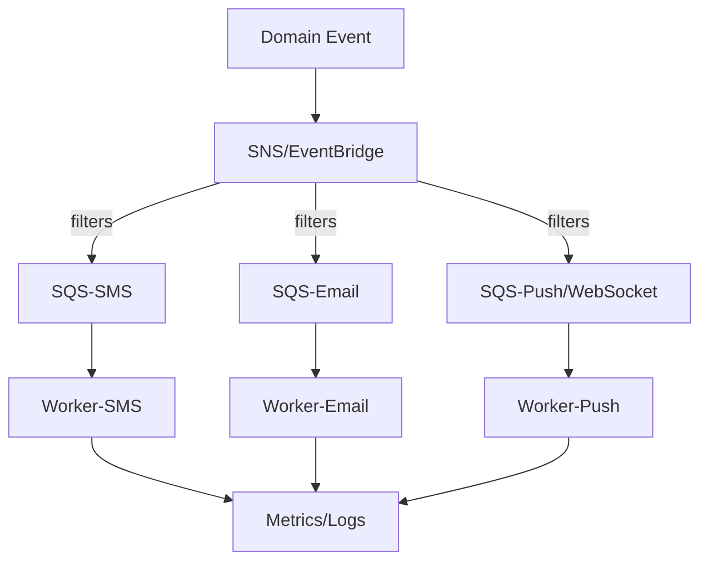

---

## Areas to Emphasize in Interviews
- How auth and multi-tenancy propagate (Authorizer → claims → IAM → data partitioning).
- Reliability patterns (retries, DLQs, idempotency keys) and how we’d harden them.
- Data modeling choices (when DynamoDB vs Postgres) and migration strategy.
- Event contracts and observability (structured logging, traces, metrics).
- Performance levers (bundle size, cold start mitigation, connector timeouts).
- Team practices: code quality gates (Ruff/Mypy/Pytest), Makefile-driven workflows, branch-to-environment mapping.

---

## Suggested Conversational Anchors
- A recent flow you can narrate: "Webchat message → API Gateway → Authorizer → FastAPI → EventBridge → SQS → worker → Stream Chat push + notification email."
- A design trade-off: "We keep workflow definitions in Postgres for integrity, but runtime state in DynamoDB for scale; Step Functions orchestrates long-running paths."
- A reliability fix: "Introduce idempotency keys on queue messages and outbox pattern on writes to prevent duplicates under retries."

---

## Quick Prep Checklist
- Review FastAPI dependency injection, background tasks, and Pydantic v2.
- Refresh AWS: API Gateway auth flow, SQS/SNS/EventBridge patterns, Step Functions retries, SAM basics.
- DynamoDB modeling: PK/SK, GSIs, hot partition avoidance, TTL usage.
- GenAI: prompt/versioning, safety, cost control; Stream Chat/WebSocket reconnect logic.
- CI/CD: GitHub Actions flows, env promotion order, Docker multi-stage builds, CodeArtifact publishing.

---

This document is tailored to App0’s architecture and the Lead Python Developer (API & Cloud Systems) role requirements. Adapt examples to the interviewer’s focus areas. 

---

## Service Deep Dives with APIs & Diagrams

### app0-tools-service (FastAPI) — evals/tools workflows
- **Purpose:** Orchestrates tools/evaluations, LLM calls, and connector-driven actions; deployable to Lambda/ECS.
- **APIs (illustrative):**
  - `POST /v1/conversations/{conversation_id}/eval`: run an evaluation for a conversation/tool.
  - `POST /v1/tools/{tool_id}/execute`: execute a tool with inputs; often enqueues async work.
  - `GET /v1/evals/{eval_id}/status`: check async eval result/state.
- **Patterns:**
  - Pydantic request/response schemas; FastAPI dependencies for auth/tenant/context.
  - Writes emit domain events → EventBridge/SNS → SQS worker for long-running evals.
  - Connectors layer wraps LLMs/Shopify/etc. with retries/backoff and idempotency keys.
  - Observability: Structlog + OTEL; DLQ alarms for eval failures.
- **Mermaid (Eval flow):**
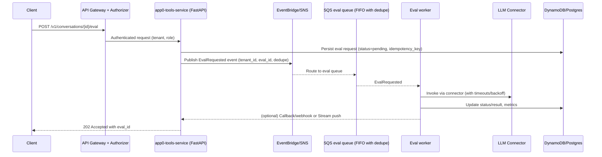

**API Example (FastAPI style):**
```python
@router.post("/v1/conversations/{conversation_id}/eval", response_model=EvalResponse, status_code=202)
async def run_eval(
    conversation_id: str,
    payload: EvalRequest,
    ctx: RequestContext = Depends(require_tenant_context),
    svc: EvalService = Depends(get_eval_service),
):
    # validates tenant/role, dedupes by idempotency key, emits event
    return await svc.start_eval(ctx, conversation_id, payload)
```

### vigilant-funicular (Django/DRF) — multi-tenant comms & workflows
- **Purpose:** Core admin/visitor APIs (messaging, contacts, flows, agents, ecommerce).
- **APIs (illustrative):**
  - `POST /v1/flows/{flow_id}/start`: start a workflow instance (may trigger Step Functions/SQS).
  - `POST /v1/conversations/{conversation_id}/messages`: add admin message; triggers notifications.
  - `GET /visitor/v1/webchat/faq`: tenant-aware FAQ retrieval for webchat.
- **Patterns:**
  - DRF serializers + middleware inject tenant/context; RBAC via roles (TenantAdmin/OperationUser/etc.).
  - DynamoDB for chat/contact operational data; Postgres for definitions/templates where relational is needed.
  - Emits domain events to EventBridge/SNS; async processors handle notifications, syncs, analytics.
  - Real-time: Stream Chat integration; WebSocket pushes for live updates.
- **Mermaid (Workflow start):**
```mermaid
flowchart TD
    A[POST /v1/flows/{id}/start] --> B[Auth middleware (tenant/role)]
    B --> C[DRF view validates payload]
    C --> D[Persist instance (DDB PK tenant#instance, state=pending)]
    D --> E[Emit FlowStarted event (EventBridge/SNS)]
    E --> F[SQS worker / Step Functions]
    F --> G[Execute steps (connectors, actions)]
    G --> H[Update state, audits, notifications]
```

**API Example (DRF style):**
```python
class FlowStartView(APIView):
    permission_classes = [IsTenantAuthenticated]

    def post(self, request, flow_id: str):
        ctx = request.tenant_context  # injected by middleware
        payload = FlowStartSerializer(data=request.data)
        payload.is_valid(raise_exception=True)
        instance = flow_service.start(flow_id, payload.validated_data, ctx)
        return Response({"instance_id": instance.id, "status": "pending"}, status=202)
```

---

## Expanded Visuals (Mermaid)

### Auth + Tenant Propagation
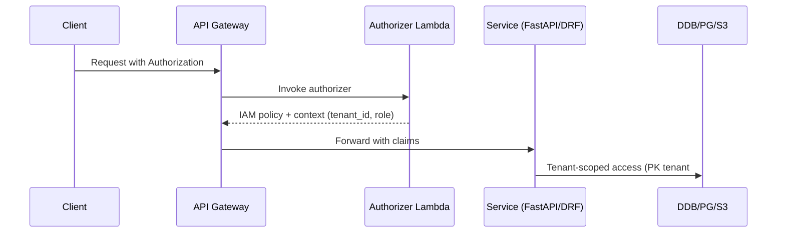

### Notification Fan-out (channel-filtered)
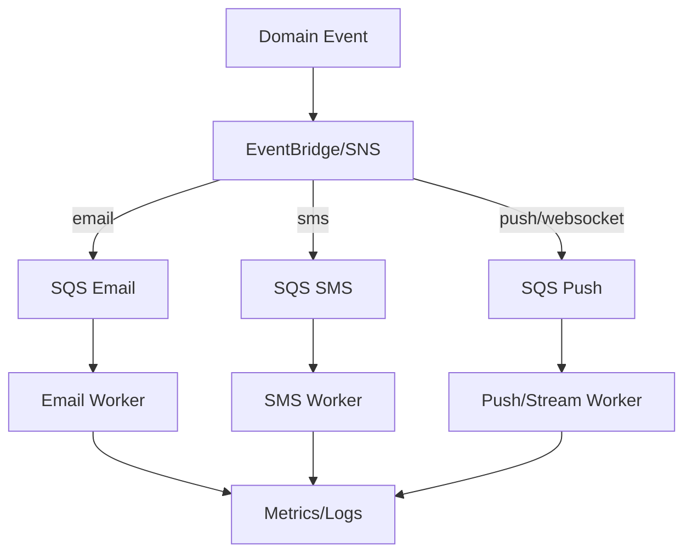

### Webchat to Backend Flow
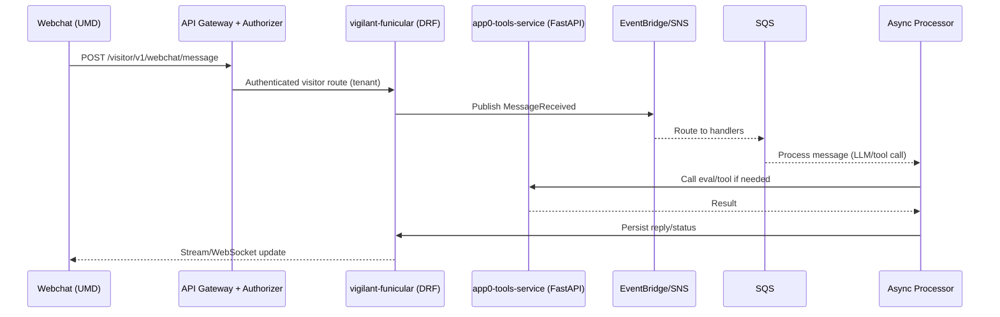

---

## How to Use This in the Interview (service-specific)
- **For app0-tools-service:** Emphasize FastAPI patterns, event emission for evals, LLM connector safety (timeouts/backoff/idempotency), and how results flow back (status polling or callbacks). Talk through the eval sequence diagram.  
- **For vigilant-funicular:** Emphasize DRF middleware for tenant context, mixed storage (DynamoDB operational + Postgres definitions), and event-driven notifications/workflows. Walk the workflow-start diagram.  
- **Cross-cutting:** Point to the auth propagation and notification fan-out diagrams to show multi-tenant safety and channel-specific processing.  
- **APIs:** Use the sample endpoints to illustrate request/response expectations, validation, and async handling (202 Accepted with async status).

---

## app0-tools-service: Complete Feature Documentation

### Overview
**app0-tools-service** is a FastAPI-based microservice that provides orchestration for AI tools, evaluations, knowledge search, workflows, conversations, and integrations. It serves as the primary API layer for LLM-powered features, workflow automation, and real-time conversation management.

**Deployment:** AWS Lambda (serverless) or ECS containers  
**Root Path:** `/api/2024-06`  
**Authentication:** Bearer tokens (JWT), API keys, Client ID (per endpoint)

---

## Feature Categories & APIs

### 1. Conversation Evaluation System

#### Purpose
Automated evaluation of AI conversations using multiple evaluator types (hallucination, relevancy, faithfulness, contextual precision). Supports batch execution, suite management, and real-time turn evaluation.

#### Key Endpoints
- `POST /evaluation/suites` - Create evaluation suite
- `POST /evaluation/suites/{suite_id}/evals` - Add test case to suite
- `POST /evaluation/suites/{suite_id}/execute` - Execute suite (async, background task)
- `GET /evaluation/executions/{execution_id}/status` - Poll execution status
- `GET /evaluation/executions/{execution_id}/summary` - Get aggregated results
- `POST /evaluation/turn-conversation` - Evaluate specific conversation turn

#### Schema Design

**PostgreSQL Tables:**
```sql
-- Evaluation Suites (definitions)
CREATE TABLE eval_suites (
    id SERIAL PRIMARY KEY,
    tenant_id UUID NOT NULL,
    name VARCHAR(255) NOT NULL,
    evaluator_config JSONB,
    created_at TIMESTAMP DEFAULT NOW(),
    updated_at TIMESTAMP DEFAULT NOW(),
    UNIQUE(tenant_id, name)
);

-- Individual Test Cases (evals)
CREATE TABLE evals (
    id SERIAL PRIMARY KEY,
    tenant_id UUID NOT NULL,
    eval_suite_id INTEGER REFERENCES eval_suites(id),
    evaluator_types TEXT[] NOT NULL,  -- ['hallucination', 'answer_relevancy', ...]
    expected_values JSONB,
    user_input TEXT NOT NULL,
    conversation_context JSONB,
    source_conversation_id VARCHAR(255),
    created_at TIMESTAMP DEFAULT NOW(),
    updated_at TIMESTAMP DEFAULT NOW()
);

-- Suite Executions (runtime tracking)
CREATE TABLE eval_suite_executions (
    id SERIAL PRIMARY KEY,
    tenant_id UUID NOT NULL,
    eval_suite_id INTEGER REFERENCES eval_suites(id),
    name VARCHAR(255),
    status VARCHAR(50) DEFAULT 'pending',  -- pending, running, completed, failed
    execution_percentage INTEGER DEFAULT 0,
    summary JSONB,  -- aggregated results
    conversation_spec_id VARCHAR(255),
    flow_name VARCHAR(255),
    created_at TIMESTAMP DEFAULT NOW(),
    updated_at TIMESTAMP DEFAULT NOW()
);

-- Individual Eval Execution Results
CREATE TABLE eval_executions (
    id SERIAL PRIMARY KEY,
    tenant_id UUID NOT NULL,
    eval_suite_execution_id INTEGER REFERENCES eval_suite_executions(id),
    eval_id INTEGER REFERENCES evals(id),
    evaluator_type VARCHAR(100) NOT NULL,
    status VARCHAR(50) DEFAULT 'pending',
    result JSONB,  -- {score, passed, reasoning, system_response, evaluations}
    created_at TIMESTAMP DEFAULT NOW()
);

CREATE INDEX idx_evals_tenant_suite ON evals(tenant_id, eval_suite_id);
CREATE INDEX idx_executions_tenant_suite ON eval_executions(tenant_id, eval_suite_execution_id);
CREATE INDEX idx_executions_eval ON eval_executions(eval_id);
```

#### Sequence Diagram: Suite Execution Flow

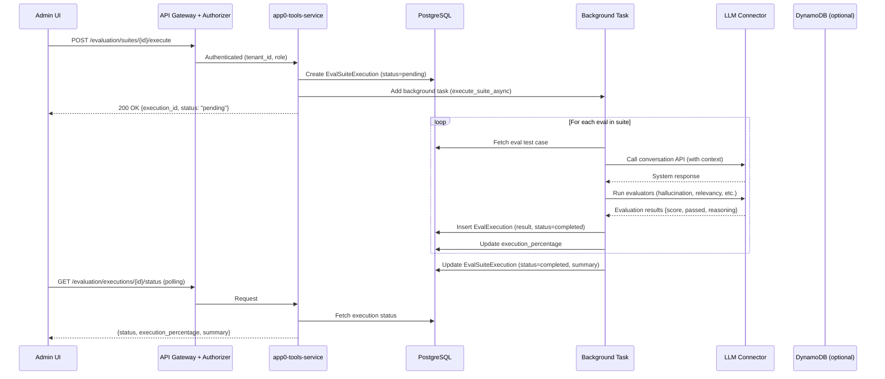

#### API Example: Create and Execute Suite

```python
# Request: POST /evaluation/suites
{
    "name": "FAQ Accuracy Suite",
    "evaluator_config": {
        "default_threshold": 0.8,
        "timeout_seconds": 30
    }
}

# Request: POST /evaluation/suites/{suite_id}/evals
{
    "evaluator_types": ["hallucination", "answer_relevancy", "faithfulness"],
    "expected_values": {
        "answer_relevancy": {"min_score": 0.7},
        "faithfulness": {"min_score": 0.8}
    },
    "user_input": "What is your return policy?",
    "conversation_context": {
        "knowledge_base": "returns_policy_v2",
        "product_id": "prod_123"
    },
    "source_conversation_id": "conv_abc123"
}

# Request: POST /evaluation/suites/{suite_id}/execute
{
    "conversation_spec_id": "spec_xyz",
    "batch_size": 10,
    "max_concurrent": 5
}

# Response: 200 OK
{
    "success": true,
    "data": {
        "id": 42,
        "status": "pending",
        "execution_percentage": 0,
        "created_at": "2024-01-15T10:30:00Z"
    }
}
```

---

### 2. Workflow Management (Flows)

#### Purpose
Visual workflow builder with versioning, audit trails, and execution tracking. Supports automation workflows, UI flows, and conversation flows.

#### Key Endpoints
- `GET /api/flows` - List flows (with advanced filtering: `name__icontains`, `status__in`, `created_at__gte`)
- `GET /api/flows/{flow_id}` - Get flow by ID
- `GET /api/flows/name/{name}` - Get flow by name
- `PUT /api/flows/{flow_id}` - Update flow (creates new version)
- `DELETE /api/flows/{flow_id}` - Soft delete
- `GET /api/flows/{flow_id}/versions` - Version history
- `GET /api/flows/{flow_id}/versions/{version}` - Get specific version
- `GET /api/flows/{flow_id}/compare?from_version=X&to_version=Y` - Compare versions
- `POST /api/flows/{flow_id}/versions/{version}/restore` - Restore to version

#### Schema Design

**PostgreSQL Tables:**
```sql
-- Flow Definitions
CREATE TABLE flows (
    id UUID PRIMARY KEY DEFAULT gen_random_uuid(),
    tenant_id UUID NOT NULL,
    name VARCHAR(255) NOT NULL,
    status VARCHAR(50) NOT NULL,  -- draft, active, archived
    type VARCHAR(100),  -- automation, ui_flow, conversation
    action_components JSONB NOT NULL,  -- workflow steps/nodes
    flow_local_variables TEXT[],
    valid_request_body JSONB,
    compliance_body JSONB,
    viewport JSONB,  -- UI flow viewport config
    test_context JSONB,
    version INTEGER DEFAULT 1,
    created_at TIMESTAMP DEFAULT NOW(),
    created_by VARCHAR(255),
    updated_at TIMESTAMP DEFAULT NOW(),
    updated_by VARCHAR(255),
    deleted_at TIMESTAMP,
    deleted_by VARCHAR(255),
    UNIQUE(tenant_id, name)
);

-- Flow Version History (audit table)
CREATE TABLE flow_versions (
    id UUID PRIMARY KEY DEFAULT gen_random_uuid(),
    flow_id UUID REFERENCES flows(id),
    tenant_id UUID NOT NULL,
    version INTEGER NOT NULL,
    action_components JSONB,
    flow_local_variables TEXT[],
    valid_request_body JSONB,
    compliance_body JSONB,
    viewport JSONB,
    test_context JSONB,
    audit_ts TIMESTAMP DEFAULT NOW(),
    updated_by VARCHAR(255),
    UNIQUE(flow_id, version)
);

CREATE INDEX idx_flows_tenant_status ON flows(tenant_id, status);
CREATE INDEX idx_flows_tenant_name ON flows(tenant_id, name);
CREATE INDEX idx_flow_versions_flow ON flow_versions(flow_id, version);
```

**DynamoDB (Runtime Instances):**
- PK: `tenant_id#flow_instance_id`
- SK: `step_timestamp`
- Attributes: `state`, `current_step`, `context`, `attempts`, `expires_at`, `status`

#### Sequence Diagram: Flow Update with Versioning

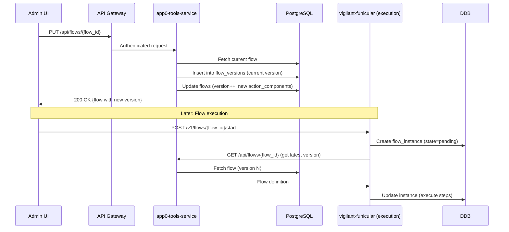

#### Advanced Filtering Example

```python
# Query: GET /api/flows?name__icontains=workflow&status__in=draft,active&sort_by=created_at&sort_order=DESC&limit=20&cursor=eyJpZCI6IjEyMyJ9

# Supports operators:
# - name=My Flow (equals)
# - status__in=draft,active (multiple values)
# - name__icontains=workflow (case-insensitive contains)
# - created_at__gte=2024-01-01 (greater than or equal)
# - updated_by__field_ne=created_by (field comparison)
```

---

### 3. Knowledge Base & Search

#### Purpose
Vector-based knowledge search with chunking, product-aware filtering, and multi-source content management.

#### Key Endpoints
- `POST /knowledge/{knowledge_name}/search` - Semantic search with product filtering
- `GET /knowledge/{knowledge_name}/sources` - List source files

#### Schema Design

**PostgreSQL (Knowledge Definitions):**
```sql
CREATE TABLE knowledge (
    id UUID PRIMARY KEY DEFAULT gen_random_uuid(),
    tenant_id UUID NOT NULL,
    name VARCHAR(255) NOT NULL,
    description TEXT,
    source_files JSONB,  -- [{name, file_path, knowledge_content_type, ...}]
    created_at TIMESTAMP DEFAULT NOW(),
    updated_at TIMESTAMP DEFAULT NOW(),
    UNIQUE(tenant_id, name)
);
```

**DynamoDB (Knowledge Content & Chunks):**
- PK: `tenant_id#knowledge_name#content_id`
- SK: `chunk_ordinal`
- Attributes: `content`, `content_type`, `metadata`, `product_id`, `product_name`, `source_file_name`, `embedding_ref`, `chunk_position` (start/end line, page_number)

#### Sequence Diagram: Knowledge Search Flow

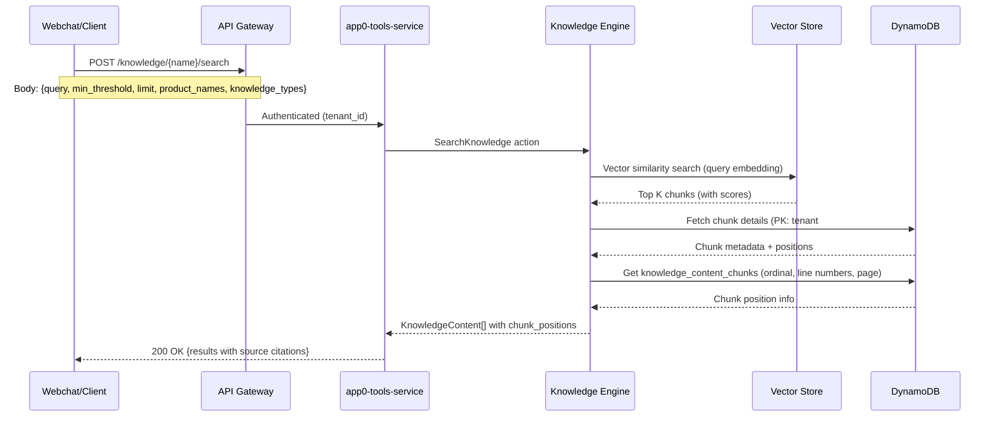

#### API Example

```python
# Request: POST /knowledge/faq_base/search
{
    "query": "What is your return policy?",
    "min_threshold": 0.7,
    "limit": 5,
    "product_names": ["Product A", "Product B"],
    "knowledge_types": ["faq", "documentation"],
    "search_by_category": true
}

# Response: 200 OK
{
    "success": true,
    "data": [
        {
            "id": "content_123",
            "content": "Our return policy allows returns within 30 days...",
            "content_type": "faq",
            "score": 0.89,
            "chunk_positions": [
                {
                    "chunk_ordinal": 1,
                    "start_line": 10,
                    "end_line": 15,
                    "page_number": 1,
                    "text_chunk": "Our return policy..."
                }
            ],
            "source_file_name": "returns_policy.pdf",
            "knowledge_name": "faq_base"
        }
    ]
}
```

---

### 4. Conversations & Real-time Messaging

#### Purpose
Conversation initiation, resumption, action handling, and file management for webchat and admin interfaces.

#### Key Endpoints
- `GET /conversations/info` - Get conversation context (customer_id, page_url)
- `POST /conversations/initiate` - Start new conversation
- `POST /conversations/resume` - Resume existing conversation
- `POST /conversations/actions` - Execute conversation action (LLM call, tool invocation)
- `GET /conversations/{conversation_id}/files/{file_id}` - Download conversation file
- `POST /streaming/conversations/actions` - Server-Sent Events (SSE) streaming

#### Schema Design

**DynamoDB (Conversations):**
- PK: `tenant_id#conversation_id`
- SK: `message_timestamp` or `metadata`
- Attributes: `participant_id`, `channel`, `status`, `flow_instance_id`, `metadata`, `external_id`

**DynamoDB (Conversation Files):**
- PK: `tenant_id#conversation_id#file_id`
- Attributes: `filename`, `mime_type`, `file_data` (base64 or S3 ref), `uploaded_at`

#### Sequence Diagram: Conversation Initiation & Action

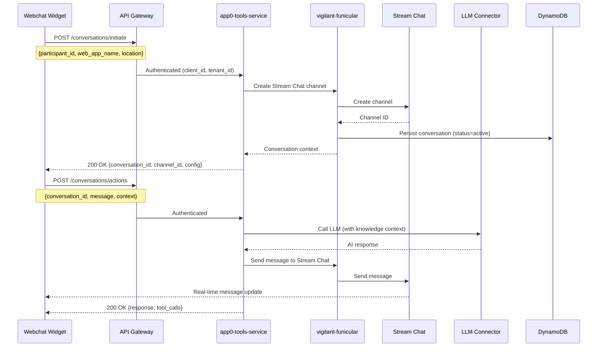

#### Streaming API Example

```python
# Request: POST /streaming/conversations/actions
{
    "conversation_id": "conv_123",
    "message": "What products do you recommend?",
    "context": {"page_url": "/products"}
}

# Response: text/event-stream
data: {"event": "thinking", "value": "Searching products...", "sequence": 1}

data: {"event": "tool_call", "value": {"tool": "search_products", "args": {...}}, "sequence": 2}

data: {"event": "response_chunk", "value": "Based on your preferences, I recommend...", "sequence": 3}

data: {"event": "complete", "value": "Response complete", "sequence": 4}
```

---

### 5. Products & E-commerce Integration

#### Purpose
Product retrieval, comparison, selling plans, and AI-powered product questions.

#### Key Endpoints
- `GET /products?product_ids=id1,id2&mappings=[{"source":"price","to":"cost"}]` - Get products with field mapping
- `GET /products/comparable?product_id=X&attributes_to_match=color,size&limit=5` - Find comparable products
- `GET /products/{attribute}/{value}/selling_plans` - Get subscription plans
- `POST /products/{attribute}/{value}/questions` - Generate product questions (AI)

#### Schema Design

**DynamoDB (Products - synced from Shopify):**
- PK: `tenant_id#product_id`
- Attributes: `name`, `description`, `price`, `variants`, `selling_plans`, `metadata`, `synced_at`

#### Sequence Diagram: Product Questions Generation

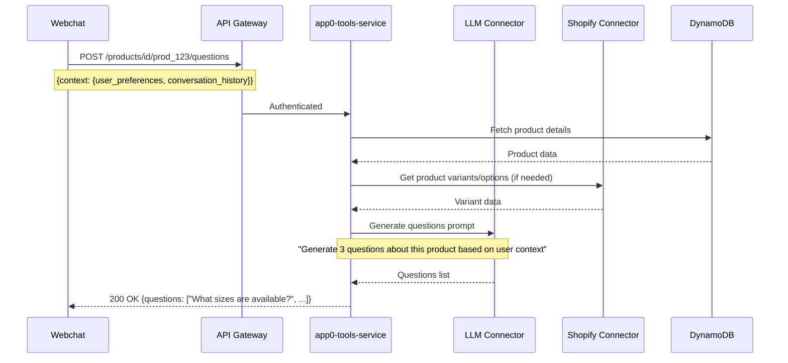

---

### 6. UI Flows (Interactive Forms & Workflows)

#### Purpose
Visual UI flow builder for customer-facing forms, quizzes, and interactive experiences.

#### Key Endpoints (Admin):
- `GET /admin/ui-flows` - List UI flows
- `GET /admin/ui-flows/{flow_id}` - Get flow definition
- `POST /admin/ui-flows` - Create UI flow
- `PUT /admin/ui-flows/{flow_id}` - Update flow
- `DELETE /admin/ui-flows/{flow_id}` - Delete flow
- `GET /admin/ui-flows/{flow_id}/instances` - List flow instances
- `GET /admin/ui-flows/{flow_id}/instances/{instance_id}` - Get instance state

#### Schema Design

**DynamoDB (UI Flow Definitions):**
- PK: `tenant_id#ui_flow_id`
- Attributes: `name`, `steps` (JSON array), `variables`, `config`, `version`, `created_at`

**DynamoDB (UI Flow Instances):**
- PK: `tenant_id#instance_id`
- SK: `step_id` or `state`
- Attributes: `flow_id`, `current_step`, `data`, `status`, `completed_at`

---

### 7. Tools & Tool Execution

#### Purpose
Dynamic tool invocation system for LLM agents (function calling).

#### Key Endpoints
- `POST /tools/{function}/invoke` - Execute a tool function
- `GET /admin/tools` - List available tools
- `GET /admin/tools/{tool_name}` - Get tool definition (schema)

#### Sequence Diagram: Tool Invocation

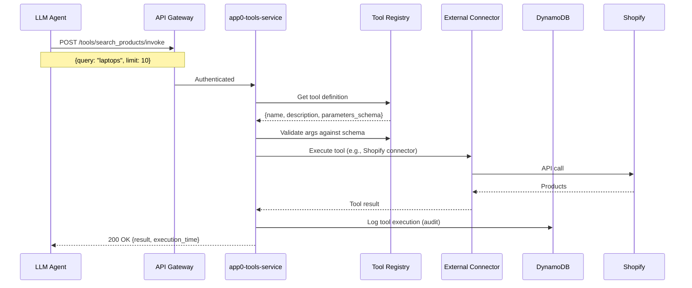

---

### 8. Templates (Jinja2 Template Engine)

#### Purpose
Dynamic template rendering and AI-powered template generation.

#### Key Endpoints
- `POST /admin/jinja2-templates/render` - Render template with data
- `POST /admin/jinja2-templates/generate` - Generate template using AI

#### API Example

```python
# Request: POST /admin/jinja2-templates/render
{
    "template": "Hello {{ name }}, you have {{ count }} items in your cart!",
    "data": {
        "name": "John",
        "count": 5
    }
}

# Response: 200 OK
{
    "success": true,
    "data": {
        "rendered": "Hello John, you have 5 items in your cart!",
        "template": "Hello {{ name }}, you have {{ count }} items in your cart!"
    }
}

# Request: POST /admin/jinja2-templates/generate
{
    "description": "Create an email template for order confirmation",
    "sample_data": {
        "customer_name": "John Doe",
        "order_number": "12345",
        "items": [{"name": "Product A", "price": 25.99}],
        "total": 25.99
    }
}

# Response: 200 OK
{
    "success": true,
    "data": {
        "template": "{{ customer_name }}, your order #{{ order_number }} has been confirmed. Total: ${{ total }}",
        "description": "Create an email template for order confirmation"
    }
}
```

---

### 9. File Upload & S3 Management

#### Purpose
File upload to S3 with tenant-scoped organization and SFTP support.

#### Key Endpoints
- `POST /s3/upload?prefix=folder&upload_type=standard|sftp` - Upload file
- `GET /s3/files?bucket=X&prefix=Y&next_token=Z` - List S3 files (paginated)

#### Schema Design

**S3 Structure:**
```
app0-{env}-data/
  {tenant_id}/
    {prefix}/
      {YYYYMMDD}_{filename}

app0-{env}-sftp/
  {tenant_id}/
    {filename}
```

---

### 10. Sessions Management

#### Purpose
Session state management for conversation context and user interactions.

#### Key Endpoints
- `POST /sessions/sessions` - Create session
- `PUT /sessions/sessions/{session_id}` - Update session context
- `GET /sessions/sessions/{session_id}` - Get session

#### Schema Design

**DynamoDB (Sessions):**
- PK: `tenant_id#session_id`
- Attributes: `context` (JSON), `created_at`, `updated_at`, `expires_at` (TTL)

---

### 11. OTP (One-Time Password)

#### Purpose
OTP generation and delivery via email/SMS for authentication.

#### Key Endpoints
- `POST /otp/send` - Send OTP (email or SMS)

#### Sequence Diagram: OTP Flow

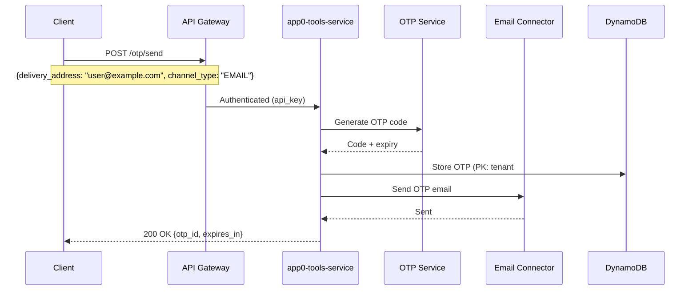

---

### 12. Search (Product Search)

#### Purpose
Semantic product search with filters and ranking.

#### Key Endpoints
- `POST /search/products` - Search products with filters

---

### 13. Tenant Configuration

#### Purpose
Feature flags and tenant-specific configuration management.

#### Key Endpoints
- `POST /tenant-configuration/{feature_name}` - Set configuration
- `GET /tenant-configuration` - Get all configurations
- `GET /tenant-configuration/{feature_name}` - Get specific configuration
- `DELETE /tenant-configuration/{feature_name}` - Delete configuration

#### Schema Design

**DynamoDB (Tenant Configurations):**
- PK: `tenant_id#feature_name`
- Attributes: `feature_value` (JSON), `created_at`, `updated_at`

---

### 14. Additional Features

- **Conversation Macros** - Pre-defined message templates
- **Conversation Starters** - Suggested conversation prompts
- **Conversation Feedback** - User feedback collection
- **Outgoing Webhooks** - Webhook delivery management
- **OAuth** - OAuth integration management
- **Google Sheets** - Google Sheets integration
- **Subscriptions** - Subscription management (Shopify selling plans)
- **Stores** - Store/order management
- **Tickets** - Support ticket integration
- **Events Client** - Client-side event tracking
- **Sync Data** - Shopify data synchronization

---

## Complete Architecture Diagram: app0-tools-service

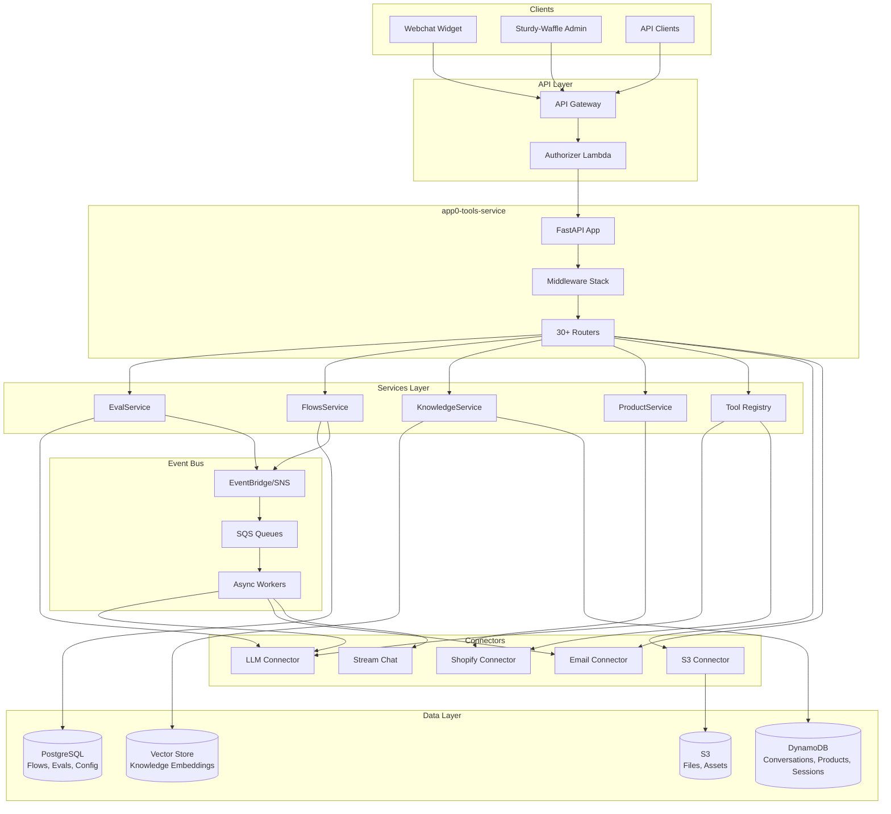

---

## Key Design Patterns in app0-tools-service

1. **Action Pattern**: Each feature uses an Action class (e.g., `SearchKnowledge`, `SendOTPAction`) that encapsulates business logic and connector calls.
2. **Repository Pattern**: Data access abstracted through repositories (e.g., `EvalService.repository`, `FlowsRepository`).
3. **Connector Abstraction**: External APIs wrapped in connector libraries (`app0-connector-*`) with retries, backoff, and error handling.
4. **Background Tasks**: Long-running operations (eval execution, file processing) use FastAPI `BackgroundTasks` or async workers.
5. **Multi-tenant Isolation**: All data access scoped by `tenant_id` from context; enforced at repository/service layer.
6. **Versioning**: Flows and evals support version history with audit trails in PostgreSQL.
7. **Streaming**: SSE endpoints for real-time updates (conversation actions, eval progress).
8. **Idempotency**: Critical operations (eval execution, tool calls) support idempotency keys.

---

## Interview Talking Points

- **"How do you handle long-running evaluations?"**  
  Background tasks + status polling. Suite execution creates a pending record, enqueues async work, and clients poll `/executions/{id}/status`. Results stored in PostgreSQL with JSONB for flexible result schemas.

- **"How do you ensure multi-tenant data isolation?"**  
  Authorizer injects `tenant_id` into context; all repositories filter by `tenant_id`. PostgreSQL uses row-level filtering; DynamoDB uses composite keys (`tenant_id#entity_id`).

- **"How do you handle tool execution failures?"**  
  Connectors implement retries with exponential backoff. Tool executions are logged to DynamoDB for audit. Failed executions can trigger DLQ processing or manual retry.

- **"How do you scale knowledge search?"**  
  Vector store for embeddings (external service), DynamoDB for metadata and chunk positions. Search results cached by query hash + tenant. Product filtering applied post-vector search.

- **"How do you version workflows?"**  
  PostgreSQL audit table (`flow_versions`) stores every update. Flow updates create new version; execution always uses latest unless specified. Version comparison API for diff visualization.

This comprehensive documentation covers all major features of app0-tools-service with schemas, sequence diagrams, and API examples ready for interview discussions.

